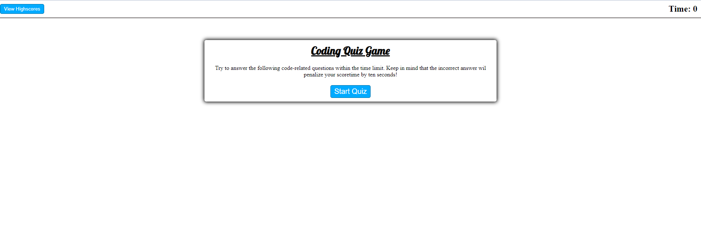
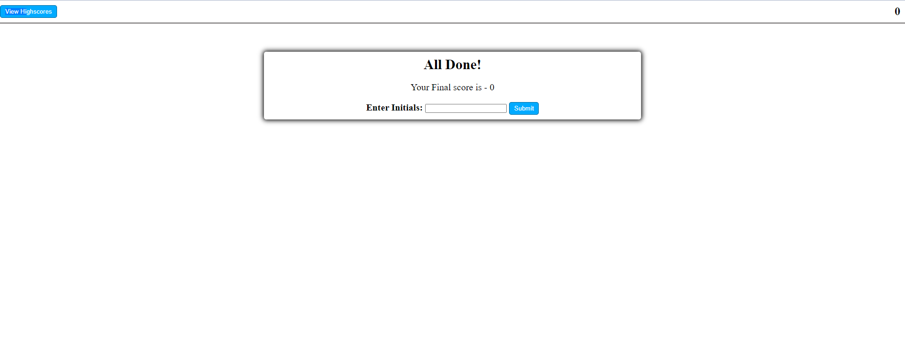

# Code_Quiz_Program
## Table of Contents
1. [General Info](#general-info)
2. [Screenshots](#screenshots)
3. [Webpage link](#Webpage-link)
4. [Resources](#resources)

Author: Takara Truong
### General Info
This program generates a Coding Quiz game where users are asked various coding related questions within a given amount of time. Users are notified if the answer they chose is correct and if incorrect, time is deducted from their overall time by 10 seconds. Once a user completes the game, they will recieve a score which is the amount of time left on the timer. User is then prompted whether they want to save the score or not and enter their initials. The page is redirected to a page containing past highscores of past user results. The user an then either erase all scores or return to the game starting page. 

This project taught me how to implement javascript and to utilize more web API features such as local storage. I learned to better understand how to use objects, create elements using javascript, create timers, and update page contents to change the page layout and content. The biggest issue I encountered was updating the questions and their answer options. This was solved by initializing the list elements in the html first then updating its text content instead of creating the elements for each question. Another issue I ran into was storing the scores into the localStorage. I was not able to add more than one score which were stored in a array. This was fixed by having a intializing function grab and update the score array before running the game if any values were previously stored. I hope to eventually create a better layout possibly implementing bootstrap, to somehow order the highscores by score, and hide excess scores. 

### Screenshots
Code Quiz Game Screenshots

### Website link
https://truont2.github.io/Code_Quiz_Program/

### Resources
* https://developer.mozilla.org/en-US/docs/Web/API/GlobalEventHandlers/onclick
* https://developer.mozilla.org/en-US/docs/Web/API/Element/classList
* https://developer.mozilla.org/en-US/docs/Web/API/Window/localStorage
